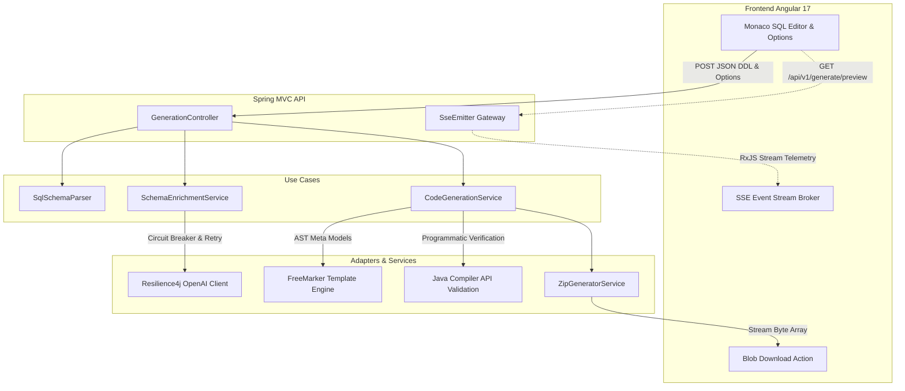

# APIForge

[](https://github.com/joaogabriel43/APIForge/actions)
[](https://openjdk.org/projects/jdk/21/)
[](https://spring.io/projects/spring-boot)
[](https://angular.dev/)
[](https://tailwindcss.com/)
[](https://opensource.org/licenses/MIT)

APIForge is a high-performance, developer-first web application designed to automatically parse PostgreSQL DDL schemas and compile production-ready, standardized Spring Boot REST API codebases in seconds. 

<!-- TODO: Add showcase GIF here -->

---

## 🚀 What It Does

APIForge bridges the gap between database design and backend bootstrapping. Developers paste standard PostgreSQL DDL schemas, choose dynamic enterprise features (such as JWT Security, Pagination, and Soft Delete), and instantly download a complete, zip-archived Maven project that is pre-configured, modularized, and 100% syntactically correct.

In addition to synchronous ZIP compilation downloads, APIForge incorporates a real-time reactive preview workspace. As the backend parses the SQL tables, updates relationships, and renders code templates, files are streamed instantly using **Server-Sent Events (SSE)**. Developers can browse the generated code file-by-file through a high-fidelity editor interface before initiating any downloads.

Furthermore, APIForge leverages an AI-powered enrichment layer. When enabled, it securely calls LLM models to analyze context and suggest domain-driven Javadocs and logical pluralized API route names, fully protected by industrial fault-tolerance and silent-fallback patterns.

---

## 🌐 Live Demo & Quick Start

* **Frontend Playground (Vercel)**: `https://apiforge-frontend.vercel.app` *(placeholder)*
* **Backend API Gateway (Render)**: `https://apiforge-api.onrender.com` *(placeholder)*

### Generate Code in One Command (CLI Quick Start)
To verify the REST API síncrono project generator instantly, execute the following `curl` command:

```bash
curl -X POST https://apiforge-api.onrender.com/api/v1/generate \
  -H "Content-Type: application/json" \
  -d '{
    "sql": "CREATE TABLE users (id SERIAL PRIMARY KEY, email VARCHAR(255) UNIQUE NOT NULL, created_at TIMESTAMP DEFAULT CURRENT_TIMESTAMP);",
    "packageName": "com.mycompany.usersapi",
    "generateJwt": true,
    "generatePagination": true,
    "generateSoftDelete": false,
    "enrichWithLlm": false
  }' \
  --output my-project.zip
```

---

## 🏛️ Architecture & Data Flow

APIForge strictly adheres to **Clean Architecture** guidelines, isolating core domain rules from frameworks and external delivery interfaces.



---

## ⚡ Technical Highlights

### 1. Complex SQL Parse & Relational Mapper
Natively parses standard SQL DDL statements (primary keys, foreign keys, unique bounds, indices) utilizing `JSQLParser`. Relational mapping rules accurately discover implicit associations (`One-to-One`, `One-to-Many`, `Many-to-One`, and `Many-to-Many`), automatically generating JPA mappings (`@OneToMany`, `@ManyToOne`, `@JoinColumn`) inside Java entities. It also supports complex custom database mappings like PostgreSQL native arrays (`VARCHAR[]`) and JSONB structures.

### 2. In-Memory Programmatic Compilation Verification
To guarantee that generated Java codebases are 100% syntactically correct, APIForge leverages the native **Java Compiler API (`javax.tools.JavaCompiler`)**. Generated source files are compiled programmatically in temporary in-memory workspaces using mocked Annotation Stubs (for Lombok, Jakarta Validation, and MapStruct) to prevent syntax, import, or annotation errors before ZIP creation.

### 3. Server-Sent Events (SSE) Asynchronous Streaming
Rather than blocking servlet threads during long-running code generation and template rendering, the `/preview` route runs on a separate, dedicated thread pool using Spring `SseEmitter`. File telemetry updates, step-by-step progress metrics, and compiled code tokens are streamed in real-time to the frontend.

### 4. Resilience4j AI Enhancement & Silent Fallback
API integrations with OpenAI's LLMs are completely isolated behind a resilient gateway. Protected by **Resilience4j Circuit Breakers** (configured with a sliding window size of 10 and 30s open states) and **Retry Policies**, any network exceptions, timeouts, or rate limits trigger a **Silent Fallback**. The generation pipeline seamlessly falls back to a neutral, un-enriched state, ensuring 100% service uptime.

### 5. Isolated Maven Profiles & P6Spy Query Auditing
Includes Flyway versioning scripts (`V1__init.sql`) and packages P6Spy configurations for real-time SQL execution profiling, N+1 query vulnerability protections, and runtime debugging. Build environments are managed through isolated Maven profiles (`dev`, `test`, `ci`) to decouple local environments from CI pipeline boundaries.

---

## 🛠️ Technology Stack & Justification

| Technology | Role | Why? |
| :--- | :--- | :--- |
| **Java 21 LTS** | Core Backend Platform | Leverages Records for immutable metadata storage, Pattern Matching for schema parsing, and modern, highly performant runtime optimizations. |
| **Spring Boot 3.2.11** | Enterprise Framework | Provides industry-grade dependency injection, robust JPA database integrations, and built-in Actuator health indicators. |
| **JSQLParser 4.8** | SQL Abstract Syntax Tree | Provides highly accurate, low-overhead parsing of PostgreSQL DDL syntax to capture primary/foreign keys and array mappings. |
| **FreeMarker 2.3** | Template Compiling Engine | Decouples raw source generation from Java strings, keeping templates modular, maintainable, and simple to extend. |
| **Angular 17 Standalone**| Frontend Interface | Implements standard Web components without heavy NgModule baggage, utilizing RxJS for high-performance SSE streaming. |
| **Monaco Editor** | SQL & Code Visual Workspace | Offers developer-first code highlight interfaces, offline syntax assistance, and lightweight DOM integrations. |
| **Tailwind CSS** | Styling System | Enables rich dark-mode aesthetics, responsive grids, and subtle loading animations with zero bloated CSS dependencies. |
| **PostgreSQL 16** | Auditing Persistence | Acts as a high-performance relational auditing database, keeping complete generation records. |
| **Docker & Compose** | Infrastructure Packaging | Packages multi-stage lightweight builds (Alpine runners, non-root users, customized caching Nginx proxies) to run the full stack locally with one command. |

---

## 🧪 Testing Strategy

APIForge implements a rigorous, multi-layered quality assurance matrix ensuring zero compilation errors:

* **Unit Testing (Mockito)**: Complete unit isolation verifying parser utilities, mapping logic, naming pluralizations, and FreeMarker configuration states.
* **Property-Based Testing (jqwik)**: Generates endless randomized SQL syntax definitions to stress-test the SQL schema interpreter, discovering edge-case parsing crashes.
* **Integration Testing (Testcontainers)**: Spins up actual, localized PostgreSQL instances during tests to verify Flyway migrations, JPA entity structures, and repository queries.
* **Network Mocking (WireMock)**: Simulates slow network latencies, HTTP 429 rate-limiting, and bad gateway failures from OpenAI endpoints to test Resilience4j retry policies and silent fallbacks.
* **Programmatic Compiler Assertions**: Programmatically compiles the actual output of FreeMarker templates inside automated test containers, asserting that all generated code is fully syntax-error free.

---

## 💡 Solved Challenges

### 1. In-Memory lombok & Jakarta Validation Stubbing
* **The Problem**: Compiling generated Java files programmatically using `JavaCompiler` requires external annotations (Lombok `@Data`, MapStruct `@Mapper`, Jakarta `@NotNull`) to be present on the classpath. However, including these dependencies inside the code-generator's production compile scope would bloat our runtime bundle.
* **The Solution**: Designed lightweight Annotation Stubs inside the test compile phase. The test compiler dynamically injects mocked, lightweight versions of Lombok and Jakarta interfaces during the compilation pass, guaranteeing successful compilation assertions without leaking heavy, unnecessary dependencies into the production build.

### 2. TimeLimiter AOP Limitations on Synchronous Blocks
* **The Problem**: Resilience4j's `@TimeLimiter` aspect is designed to intercept asynchronous return types (like `CompletableFuture` or `Publisher`). When placed on synchronous REST HTTP calls to the OpenAI gateway, it was completely ignored, resulting in high latency spikes when the LLM service stalled.
* **The Solution**: Bypassed aspect limitations by implementing a custom low-level **RestClient/HttpClient Factory**. Connection timeouts (`connectTimeout`) and read timeouts (`readTimeout`) are enforced directly at the socket socket level during HTTP client creation, securing strict execution windows.

### 3. OpenAI Strict JSON Mode & Schema Compliance
* **The Problem**: GPT models often inject conversational filler ("Here is your JSON...") or output invalid JSON strings when under heavy token loads, causing parsing exceptions in the enrichment parser.
* **The Solution**: Forced strict schema boundaries by enabling OpenAI's native **JSON Mode** (`response_format: { type: "json_object" }`) coupled with strict system instructions that define a mandatory JSON schema. Implemented solid try-catch fallback structures to ensure that any remaining JSON errors trigger silent fallback recovery cleanly.

### 4. Cross-Platform Directory Separations (Windows vs. Linux ZIP Paths)
* **The Problem**: Windows systems utilize backslashes (`\`) for file system paths, whereas Unix-like containers and zip file standards require forward slashes (`/`). Compiling paths natively on Windows created corrupted ZIP files when extracted on Linux environments.
* **The Solution**: Created a centralized path normalizer inside `ZipGeneratorService`. Paths are forced to Unix-like formatting by converting all backslashes to forward slashes (`path.replace('\\', '/')`) and trimming duplicate root paths, ensuring cross-platform extraction compatibility.

### 5. Angular 17 Compiler Token Collisions (Escaping the @ Symbol)
* **The Problem**: Angular 17 introduces control-flow blocks utilizing the `@` symbol (e.g., `@if`, `@for`). When Monaco Editor templates or inline HTML elements contained literal `@` symbols (such as displaying `@SpringBootApplication` annotations), the Angular compiler crashed trying to parse them as control structures.
* **The Solution**: Resolved compilation regressions by replacing literal `@` symbols with standard HTML entities (`&#64;`) within the HTML templates, allowing Monaco to render the text correctly without breaking the Angular template compiler.

---

## ⚙️ Running Locally

APIForge is fully dockerized and orchestrated. To spin up the database, the JRE backend container, and the Nginx frontend proxy, ensure you have **Docker** and **Docker Compose** installed, then run:

```bash
docker compose up --build
```

The services will initialize in the correct sequence:
1. **PostgreSQL** (`apiforge-postgres`) launches on port `5432` and completes migration scripts.
2. **Spring Boot Backend** (`apiforge-backend`) launches on port `8080` once Postgres is healthy.
3. **Nginx Frontend Web Client** (`apiforge-frontend`) launches on port `4200` once the backend actuator endpoints evaluate as healthy.

Open your browser and navigate to **`http://localhost:4200`** to access the complete interactive coding playground.

---

## 📄 License

Distributed under the **MIT License**. See `LICENSE` for more details.
